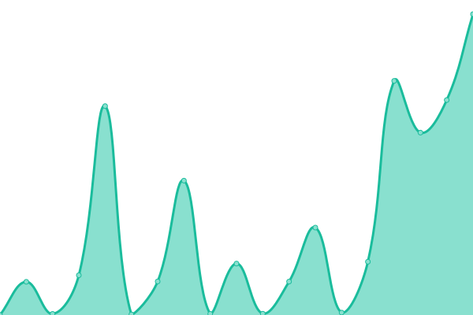

# [📈 Live Status](https://Schmitzis.github.io/Uptime): <!--live status--> **🟧 Partial outage**

This repository contains the open-source uptime monitor and status page for [Schmitzis](https://Schmitzis.github.io/Uptime), powered by [Upptime](https://github.com/upptime/upptime).

With [Upptime](https://upptime.js.org), you can get your own unlimited and free uptime monitor and status page, powered entirely by a GitHub repository. We use [Issues](https://github.com/Schmitzis/Uptime/issues) as incident reports, [Actions](https://github.com/Schmitzis/Uptime/actions) as uptime monitors, and [Pages](https://Schmitzis.github.io/Uptime) for the status page.

<!--start: status pages-->
<!-- This summary is generated by Upptime (https://github.com/upptime/upptime) -->
<!-- Do not edit this manually, your changes will be overwritten -->
<!-- prettier-ignore -->
| URL | Status | History | Response Time | Uptime |
| --- | ------ | ------- | ------------- | ------ |
|  [MSQU](https://msqu.de/healthz) | 🟩 Up | [msqu.yml](https://github.com/Schmitzis/Uptime/commits/HEAD/history/msqu.yml) | 

 490ms
     
 | 

<a href="https://Schmitzis.github.io/Uptime/history/msqu">100.00%</a>
    

|  [Ansible Galaxy](https://galaxy.ansible.com/api/v2/collections/community/general/versions/?page_size=100) | 🟨 Degraded | [ansible-galaxy.yml](https://github.com/Schmitzis/Uptime/commits/HEAD/history/ansible-galaxy.yml) | 

 4483ms
     
 | 

<a href="https://Schmitzis.github.io/Uptime/history/ansible-galaxy">99.67%</a>
    

|  [Jenkins Plugins](https://get.jenkins.io/plugins) | 🟥 Down | [jenkins-plugins.yml](https://github.com/Schmitzis/Uptime/commits/HEAD/history/jenkins-plugins.yml) | 

 52ms
     
 | 

<a href="https://Schmitzis.github.io/Uptime/history/jenkins-plugins">0.00%</a>
    

|  [CenterDevice](https://auth.centerdevice.de/login) | 🟩 Up | [center-device.yml](https://github.com/Schmitzis/Uptime/commits/HEAD/history/center-device.yml) | 

 798ms
     
 | 

<a href="https://Schmitzis.github.io/Uptime/history/center-device">100.00%</a>
    

<!--end: status pages-->

[**Visit our status website →**](https://Schmitzis.github.io/Uptime)

## 📄 License

- Powered by: [Upptime](https://github.com/upptime/upptime)
- Code: [MIT](./LICENSE) © [Schmitzis](https://Schmitzis.github.io/Uptime)
- Data in the `./history` directory: [Open Database License](https://opendatacommons.org/licenses/odbl/1-0/)
